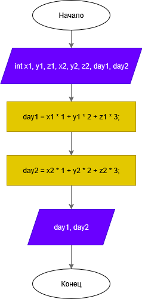
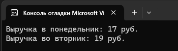

# Домашнее задание к работе 2

## Условие задачи
Фруктовый магазин продает яблоки поштучно по 1 руб., груши по 2 руб., апельсины по 3 руб. В первые два дня недели: продано понедельник – х яблок, у груш, z апельсинов; вторник - х яблок, у груш, z апельсинов. Напишите программу, которая, будет вычислять, на какую сумму продал магазин фруктов в каждый из этих дней.

## 1. Алгоритм и блок-схема

### Алгоритм
1. **Начало**
2. Задать количество проданных фруктов в понедельник (`x1`, `y1`, `z1`) и вторник (`x2`, `y2`, `z2`).
3. Вычислить сумму продаж за каждый день:
   - `day1 = x1 * 1 + y1 * 2 + z1 * 3`
   - `day2 = x2 * 1 + y2 * 2 + z2 * 3`
4. Вывести результаты.
5. **Конец**

### Блок-схема


https://github.com/DragonSov/lab2_homework/blob/master/schema.png

## 2. Реализация программы

```c
#include <stdio.h>
#include <locale.h>

int main() {
    setlocale(LC_CTYPE, "RUS");

    int x1, y1, z1, x2, y2, z2, day1, day2;

    // Понедельник
    x1 = 5;  // яблоки
    y1 = 3;  // груши
    z1 = 2;  // апельсины

    // Вторник
    x2 = 4;  // яблоки
    y2 = 6;  // груши
    z2 = 1;  // апельсины

    day1 = x1 * 1 + y1 * 2 + z1 * 3;
    day2 = x2 * 1 + y2 * 2 + z2 * 3;

    printf("Выручка в понедельник: %d руб.\n", day1);
    printf("Выручка во вторник: %d руб.\n", day2);

    return 0;
}
```

## 3. Результаты работы программы


## 4. Информация о разработчике
Попов Станислав, бИПТ-252
